# UNISCORE - Sistema de Recompensas Gamificadas

Sistema completo de gestão de pontuação e recompensas para instituições de ensino, desenvolvido com Next.js, TypeScript e Tailwind CSS.

## 🎯 Sobre o Projeto

O UNISCORE é um sistema multiempresa que permite a gestão de metas, recompensas, lançamento e confirmação de eventos, pontuação e ranking de usuários em instituições de ensino. O sistema gamifica o processo educacional, incentivando alunos através de um sistema de pontuação baseado em suas atividades e comportamentos.

## ✨ Funcionalidades

### 🏢 Gestão Principal
- **Dashboard Completo**: Visão geral com métricas, atividades recentes e ações rápidas
- **Cadastro de Empresas**: Gestão completa de instituições de ensino
- **Cadastro de Usuários**: Sistema de permissões e controle de acesso
- **Cadastro de Metas**: Definição de objetivos de pontuação para alunos
- **Cadastro de Recompensas**: Catálogo de prêmios e incentivos

### 📊 Eventos & Pontuação
- **Upload de Eventos**: Importação em lote via CSV/Excel ou cadastro individual
- **Lançamento de Eventos**: Atribuição de pontos aos alunos em tempo real
- **Confirmação de Entregas**: Gestão e confirmação de recompensas entregues

### 🎨 Interface & UX
- **Design Responsivo**: Otimizado para desktop, tablet e mobile
- **Modo Escuro**: Alternância entre tema claro e escuro
- **Tema Roxo**: Identidade visual consistente em todo o sistema
- **Componentes Modernos**: Interface construída com shadcn/ui

## 🚀 Tecnologias Utilizadas

- **Next.js 15** - Framework React com App Router
- **TypeScript** - Tipagem estática para JavaScript
- **Tailwind CSS** - Framework CSS utilitário
- **shadcn/ui** - Biblioteca de componentes React
- **Lucide React** - Ícones modernos
- **next-themes** - Gerenciamento de temas (claro/escuro)

## 📦 Instalação

1. Clone o repositório:
```bash
git clone https://github.com/seu-usuario/uniscore-admin.git
cd uniscore-admin
```

2. Instale as dependências:
```bash
npm install
# ou
yarn install
# ou
pnpm install
```

3. Execute o projeto em modo de desenvolvimento:
```bash
npm run dev
# ou
yarn dev
# ou
pnpm dev
```

4. Abra [http://localhost:3000](http://localhost:3000) no seu navegador.

## 🔐 Credenciais de Teste

O sistema possui usuários de teste pré-configurados para demonstração:

### 👨‍💼 Administrador do Sistema
- **Email**: `admin@uniscore.com`
- **Senha**: `admin123`
- **Permissões**: Acesso completo a todas as funcionalidades

### 👤 Usuário Padrão
- **Email**: `joao@colegiosaopaulo.edu.br`
- **Senha**: `joao123`
- **Empresa**: Colégio São Paulo
- **Permissões**: Acesso limitado às funcionalidades básicas

### 🏢 Conta Empresarial
- **Email**: `empresa@escolateste.edu.br`
- **Senha**: `empresa123`
- **Tipo**: Conta de empresa educacional
- **Permissões**: Gestão de usuários da própria instituição

## 📱 Responsividade

O sistema foi desenvolvido com abordagem mobile-first e é totalmente responsivo:

- **Mobile**: 320px - 768px
- **Tablet**: 768px - 1024px  
- **Desktop**: 1024px+

## 🎨 Temas

### Modo Claro
- Fundo branco com elementos em tons de cinza
- Cor primária: Roxo (#7C3AED)
- Boa legibilidade e contraste

### Modo Escuro
- Fundo escuro com elementos em tons de cinza
- Mantém a identidade visual roxa
- Reduz fadiga visual em ambientes com pouca luz

## 📁 Estrutura do Projeto

```
uniscore-admin/
├── 📁 app/                    # App Router (Next.js 15)
│   ├── 📁 dashboard/          # Dashboard principal
│   ├── 📁 empresas/           # Gestão de empresas
│   ├── 📁 usuarios/           # Gestão de usuários
│   ├── 📁 metas/              # Gestão de metas
│   ├── 📁 recompensas/        # Gestão de recompensas
│   ├── 📁 eventos/            # Gestão de eventos
│   │   ├── 📁 upload/         # Upload de eventos
│   │   ├── 📁 lancar/         # Lançamento de eventos
│   │   └── 📁 confirmar/      # Confirmação de entregas
│   ├── 📁 login/              # Tela de login
│   ├── 📁 cadastro/           # Tela de cadastro
│   ├── 📄 layout.tsx          # Layout principal
│   ├── 📄 page.tsx            # Página inicial
│   └── 📄 globals.css         # Estilos globais
├── 📁 components/             # Componentes reutilizáveis
│   ├── 📁 ui/                 # Componentes shadcn/ui
│   ├── 📄 app-sidebar.tsx     # Sidebar principal
│   ├── 📄 header.tsx          # Header com busca
│   ├── 📄 theme-provider.tsx  # Provider de tema
│   └── 📄 auth-provider.tsx   # Provider de autenticação
├── 📁 lib/                    # Utilitários e configurações
├── 📁 hooks/                  # Custom hooks
├── 📁 types/                  # Definições de tipos
├── 📄 tailwind.config.ts      # Configuração Tailwind
├── 📄 next.config.js          # Configuração Next.js
├── 📄 package.json            # Dependências
└── 📄 README.md               # Documentação
```

## 🔧 Configuração

### Variáveis de Ambiente
Crie um arquivo `.env.local` na raiz do projeto:

```env
# Configurações da aplicação
NEXT_PUBLIC_APP_NAME=UNISCORE
NEXT_PUBLIC_APP_VERSION=1.0.0

# URLs da API (quando implementar backend)
# NEXT_PUBLIC_API_URL=http://localhost:3001
# DATABASE_URL=sua_string_de_conexao
```

### Customização de Cores
Para alterar o tema roxo, edite o arquivo `tailwind.config.ts`:

```typescript
// Altere as cores primárias
primary: {
  DEFAULT: "hsl(262.1 83.3% 57.8%)", // Roxo atual
  foreground: "hsl(210 40% 98%)",
},
```

## 🎨 Design System

### **Paleta de Cores**
- 🟣 **Primária**: Purple (#8B5CF6)
- 🔵 **Secundária**: Blue (#3B82F6)
- 🟢 **Sucesso**: Green (#10B981)
- 🟡 **Aviso**: Yellow (#F59E0B)
- 🔴 **Erro**: Red (#EF4444)

### **Tipografia**
- **Fonte**: Inter (Google Fonts)
- **Tamanhos**: 12px, 14px, 16px, 18px, 24px, 32px

### **Componentes**
- 📦 **Cards**: Elevação sutil com bordas arredondadas
- 🔘 **Botões**: Estados hover e focus bem definidos
- 📝 **Formulários**: Validação em tempo real
- 📊 **Tabelas**: Ordenação e filtros avançados

## 🔧 Scripts Disponíveis

```bash
# Desenvolvimento
npm run dev          # Inicia servidor de desenvolvimento
npm run build        # Build de produção
npm run start        # Inicia servidor de produção
npm run lint         # Executa linting
npm run type-check   # Verifica tipos TypeScript
```

## 🧪 Testes

```bash
# Executar testes
npm run test         # Testes unitários
npm run test:e2e     # Testes end-to-end
npm run test:watch   # Testes em modo watch
npm run coverage     # Relatório de cobertura
```

## 📊 Funcionalidades Principais

### 🏢 **Gestão de Empresas**
- Cadastro completo de instituições de ensino
- Controle de planos e limites
- Relatórios por empresa
- Gestão de configurações específicas

### 👥 **Gestão de Usuários**
- Sistema de permissões granular
- Perfis de acesso (Admin, Usuário, Visualizador)
- Histórico de atividades
- Controle de sessões

### 🎯 **Sistema de Metas**
- Criação de metas personalizadas
- Acompanhamento em tempo real
- Diferentes tipos (Acadêmico, Frequência, Financeiro)
- Relatórios de progresso

### 🎁 **Catálogo de Recompensas**
- Gestão completa de recompensas
- Controle de estoque
- Diferentes tipos (Desconto, Produto, Certificado)
- Sistema de confirmação de entregas

### 📅 **Gestão de Eventos**
- Upload em lote via CSV/Excel
- Lançamento individual de eventos
- Confirmação de entregas
- Histórico completo

## 🏗️ Arquitetura do Sistema

```mermaid
graph TD
    A["🌐 Frontend - Next.js 15"] --> B["🔐 Auth Provider"]
    A --> C["🎨 Theme Provider"]
    A --> D["🧩 Components"]
    
    B --> E["👤 Mock Authentication"]
    B --> F["🔑 User Sessions"]
    B --> G["🛡️ Route Protection"]
    
    C --> H["☀️ Light Mode"]
    C --> I["🌙 Dark Mode"]
    C --> J["💾 Theme Persistence"]
    
    D --> K["📦 shadcn/ui Components"]
    D --> L["🎯 Custom Components"]
    D --> M["📱 Responsive Layout"]
    
    K --> N["🔘 Buttons"]
    K --> O["📝 Forms"]
    K --> P["📊 Tables"]
    K --> Q["🎴 Cards"]
    
    L --> R["🏠 Dashboard"]
    L --> S["🏢 Companies"]
    L --> T["👥 Users"]
    L --> U["🎯 Goals"]
    L --> V["🎁 Rewards"]
    L --> W["📅 Events"]
    
    X["🔮 Future Backend"] --> Y["🗄️ Database"]
    X --> Z["🔌 API Routes"]
    X --> AA["🔐 JWT Auth"]
    X --> BB["📧 Notifications"]
    
    Y --> CC["📊 PostgreSQL/Supabase"]
    Z --> DD["🚀 REST API"]
    Z --> EE["📡 GraphQL"]
    AA --> FF["🎫 Token Management"]
    BB --> GG["📱 Push Notifications"]
    BB --> HH["📧 Email System"]
    
    style A fill:#8B5CF6,stroke:#7C3AED,stroke-width:3px,color:#fff
    style X fill:#6B7280,stroke:#4B5563,stroke-width:2px,color:#fff
    style Y fill:#10B981,stroke:#059669,stroke-width:2px,color:#fff
```



## 🗺️ Roadmap

### **Versão 1.1** (Em Desenvolvimento)
- [ ] 🔐 Autenticação JWT
- [ ] 🗄️ Integração com banco de dados
- [ ] 📧 Sistema de notificações
- [ ] 📊 Relatórios avançados

### **Versão 1.2** (Planejado)
- [ ] 📱 App mobile (React Native)
- [ ] 🔔 Notificações push
- [ ] 📈 Dashboard analytics
- [ ] 🎮 Gamificação avançada

### **Versão 2.0** (Futuro)
- [ ] 🤖 IA para recomendações
- [ ] 🌐 API pública
- [ ] 🔗 Integrações externas
- [ ] 📊 Business Intelligence

## 🚧 Próximos Passos

### Funcionalidades Planejadas
- [ ] Integração com banco de dados (Supabase/PostgreSQL)
- [ ] Sistema de notificações em tempo real
- [ ] Relatórios e dashboards avançados
- [ ] API REST para integrações externas
- [ ] Sistema de backup e recuperação
- [ ] Auditoria e logs de sistema

### Melhorias Técnicas
- [ ] Testes unitários e de integração
- [ ] CI/CD com GitHub Actions
- [ ] Docker para containerização
- [ ] Monitoramento e observabilidade
- [ ] Otimização de performance

## 🤝 Contribuição

1. **Fork** o projeto
2. Crie uma **branch** para sua feature (`git checkout -b feature/AmazingFeature`)
3. **Commit** suas mudanças (`git commit -m 'Add some AmazingFeature'`)
4. **Push** para a branch (`git push origin feature/AmazingFeature`)
5. Abra um **Pull Request**

### **Padrões de Código**
- Use **TypeScript** para tipagem
- Siga o **ESLint** configurado
- Escreva **testes** para novas funcionalidades
- Documente **componentes** complexos

## 📄 Licença

Este projeto está sob a licença **MIT**. Veja o arquivo [LICENSE](LICENSE) para mais detalhes.

## 📞 Suporte

Para suporte e dúvidas:
- 📧 **Email**: suporte@uniscore.com
- 💬 **Discord**: [Servidor UNISCORE](https://discord.gg/uniscore)
- 📖 **Documentação**: [docs.uniscore.com](https://docs.uniscore.com)
- 🐛 **Issues**: [GitHub Issues](https://github.com/seu-usuario/uniscore-admin/issues)

## 📊 Métricas de Performance

- **Lighthouse Score**: 95+
- **First Contentful Paint**: < 1.5s
- **Time to Interactive**: < 3s
- **Bundle Size**: < 500KB

## 🔒 Segurança

- Autenticação baseada em JWT (planejado)
- Validação de entrada em todos os formulários
- Sanitização de dados
- HTTPS obrigatório em produção
- Rate limiting nas APIs (planejado)

## 📱 PWA (Progressive Web App)

O sistema está preparado para ser convertido em PWA:
- Service Workers para cache offline
- Manifest para instalação
- Notificações push
- Sincronização em background

---

**Desenvolvido com ❤️ pela equipe UNISCORE**

*Transformando a educação através da gamificação*
